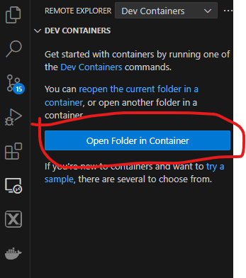

# Embedded systems with NXP LPC1769
Names are hard and projectX name is dumb. At the time of creating this repo, there was no tangible project we are working towards, so till then we will keep it as Project X. 

### Branch naming convention
 - branch should follow the name - user/<firstname>/issue_number-description.e.g. "user/mario/01-gpio"

## Getting started

### Installation
Start by installing vscode on your machine and also ensure docker is installed which should be made available once docker desktop is installed. 

We will use a docker approach to ensure that our setup remains platform agnostic. 

#### Windows
- [Install WSL](https://learn.microsoft.com/en-us/windows/wsl/install)
- Install Docker Desktop, while installing make sure to check "Use WSL 2 instead of Hyber-V"
- Follow General Setup instructions

#### MacOS
- Download Docker Desktop
    - You will have to check "use rosetta for x86/amd64 emulation on apple silicon"
- Follow General Setup instructions

#### Linux
- With docker
    - Install docker desktop
    - Follow General Setup instructions

- Without docker
  - For linux systems, if you choose to not use docker, then ensure an appropriate Ubuntu distribution is installed as the docker base image is Ubuntu v20.04. 
  - Install bazel using [bazelisk](https://github.com/bazelbuild/bazelisk/blob/master/README.md)

#### General setup
- Using Docker
    - To use the docker setup, ensure that the recommended extensions are installed. Most importantly you will need the Dev Containers extension to be installed. Once the extension is installed then you will see this icon as annotated in the screenshot below. 
    
     
    
    Once you click on it, devcontainer will ask you to open a folder. Open the infrastructor directory in this step. 

    

    After this step, the container will build. If you start a terminal in vscode, then you will see the bash user as `root@xxxx`. You can now change your directory to the firmware directory by going to File-> Open Folder. 